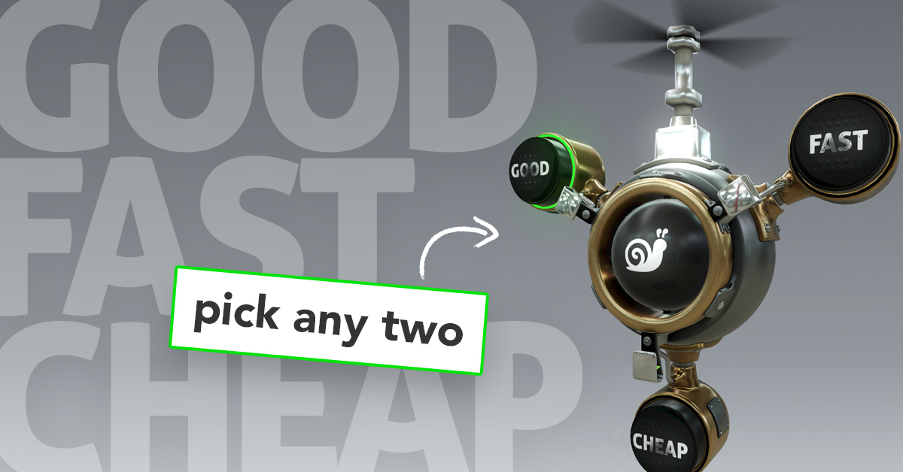

#### An experiment combining React and 3D stuffs: 

http://www.tuitivegroup.com/good-fast-cheap/

<ul>
   <li>3D modeling using <a href="https://www.blender.org/" target="_blank" rel="noreferrer noopener">Blender</a></li>
   <li>3D in the browser (mobile too!) using <a href="https://threejs.org/" target="_blank" rel="noreferrer noopener">ThreeJS</a>, <a href="https://github.com/react-spring/react-three-fiber" target="_blank" rel="noreferrer noopener">react-three-fiber</a></li>
   <li>Responsive React front-end</li>
   <li>React transitions and animation using <a href="https://www.react-spring.io/" target="_blank" rel="noreferrer noopener">React Spring</a></li>
</ul>
